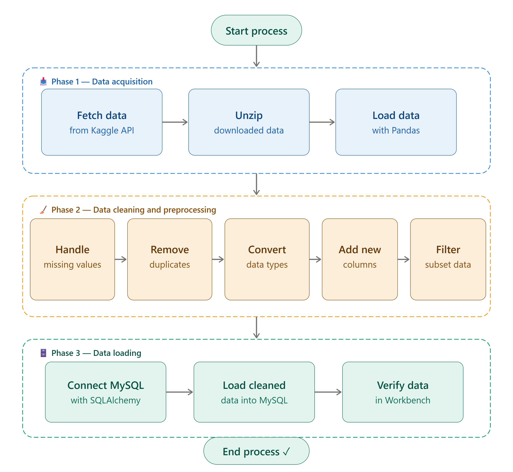

# 📊 Data Analysis Project Using Python & SQL

An end-to-end **ETL (Extract, Transform, Load)** project that takes a raw retail-orders dataset from Kaggle all the way through cleaning and transformation in **Python/Pandas** to analysis in **Microsoft SQL Server**.



---

## 🚀 Project Overview

The goal of this project is to simulate a real-world data analyst workflow:

1. **Extract** a retail orders dataset directly from Kaggle using the Kaggle API.
2. **Transform** the raw data with Pandas — cleaning, reshaping, and enriching it with new calculated columns.
3. **Load** the cleaned dataset into Microsoft SQL Server using SQLAlchemy.
4. **Analyze** the data with SQL to answer real business questions about sales, growth, and profitability.

---

## 🛠️ Tools & Technologies

| Category | Tools |
|---|---|
| Language | Python |
| Data Handling | Pandas |
| Database Connectivity | SQLAlchemy, pyodbc |
| Database | Microsoft SQL Server |
| Data Source | Kaggle API |
| Development | Jupyter Notebook |

---

## 📂 Repository Contents

| File | Description |
|---|---|
| `Order_DATA_ANLAYSIS.ipynb` | Jupyter Notebook containing the full ETL pipeline — data download, cleaning, transformation, and loading into SQL Server |
| `orders.csv` | Retail orders dataset (~10,000 rows) sourced from Kaggle |
| `sql_code.sql` | SQL queries used to analyze the data once loaded into SQL Server |
| `walmart_sales_project_flowchart.png` | Visual flowchart of the ETL pipeline |

---

## 🔄 ETL Process

```
Kaggle API
    ↓
Download & Extract Dataset (orders.csv.zip)
    ↓
Load into Pandas DataFrame
    ↓
Clean & Transform Data
    ↓
Connect to SQL Server via SQLAlchemy
    ↓
Load Data into df_orders Table
    ↓
Analyze with SQL
```

### Phase 1: Data Acquisition
- Downloaded the [Retail Orders dataset](https://www.kaggle.com/datasets/ankitbansal06/retail-orders) via the Kaggle API
- Extracted the dataset from its ZIP archive
- Loaded it into a Pandas DataFrame

### Phase 2: Data Cleaning & Preprocessing
- Treated `"Not Available"` and `"unknown"` as null values on read
- Standardized column names to lowercase with underscores (e.g. `Ship Mode` → `ship_mode`)
- Derived new columns:
  - `discount` = `list_price` × `discount_percent` × 0.01
  - `sale_price` = `list_price` − `discount`
  - `profit` = `sale_price` − `cost_price`
- Converted `order_date` to a proper datetime type
- Dropped columns no longer needed after transformation (`list_price`, `cost_price`, `discount_percent`)

### Phase 3: Data Loading
- Connected to SQL Server using SQLAlchemy + pyodbc
- Loaded the cleaned DataFrame into a SQL Server table (`df_orders`) with `df.to_sql(...)`

```python
import sqlalchemy as sal

engine = sal.create_engine(
    r"mssql+pyodbc://SERVER_NAME\SQLEXPRESS/master?driver=ODBC+Driver+17+for+SQL+Server"
)
conn = engine.connect()

df.to_sql('df_orders', con=conn, index=False, if_exists='append')
```

---

## 📈 Business Questions Answered with SQL

The queries in [`sql_code.sql`](sql_code.sql) analyze the loaded data to answer:

1. **Top 10 highest revenue-generating products**
2. **Top 5 best-selling products in each region**
3. **Month-over-month sales growth comparison (2022 vs. 2023)**
4. **Best-performing month for each product category**
5. **Sub-category with the highest profit growth in 2023 vs. 2022**

---

## 🎯 Key Skills Demonstrated

- Data extraction via API (Kaggle)
- Data cleaning & transformation with Pandas
- Working with datetime and derived/calculated fields
- Python–SQL Server connectivity using SQLAlchemy
- Writing analytical SQL (CTEs, window functions, conditional aggregation)
- End-to-end ETL pipeline design

---

## ▶️ How to Run This Project

1. Clone the repository
   ```bash
   git clone https://github.com/awsdevopsrony1/DATA_ANALYS_PROJECT-USING-PYTHON-AND-SQL.git
   ```
2. Install the required Python packages
   ```bash
   pip install pandas kaggle sqlalchemy pyodbc
   ```
3. Set up your Kaggle API credentials (`kaggle.json`) to download the dataset, or use the included `orders.csv` directly.
4. Update the SQL Server connection string in the notebook with your own server/database details.
5. Run `Order_DATA_ANLAYSIS.ipynb` cell by cell to reproduce the ETL pipeline.
6. Run the queries in `sql_code.sql` against the `df_orders` table to reproduce the analysis.

---

## 👨‍💻 Author

**Sourav Bhattacharya**
Data Analyst | SQL | Python | Power BI | Excel

⭐ If you found this project helpful, consider giving it a star on GitHub!
